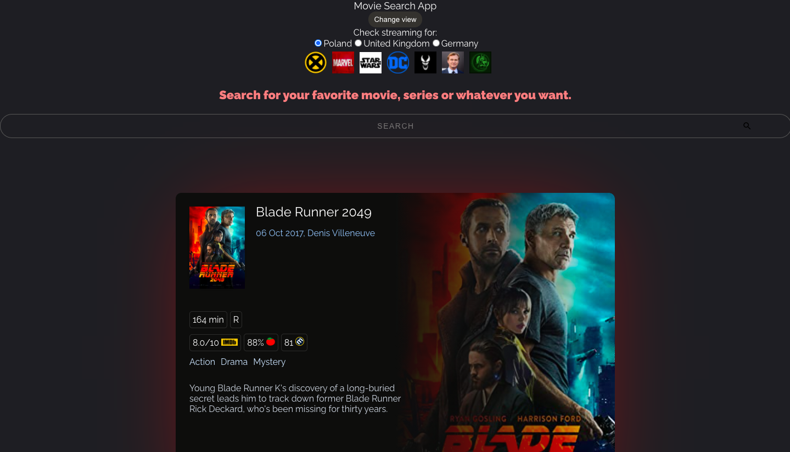
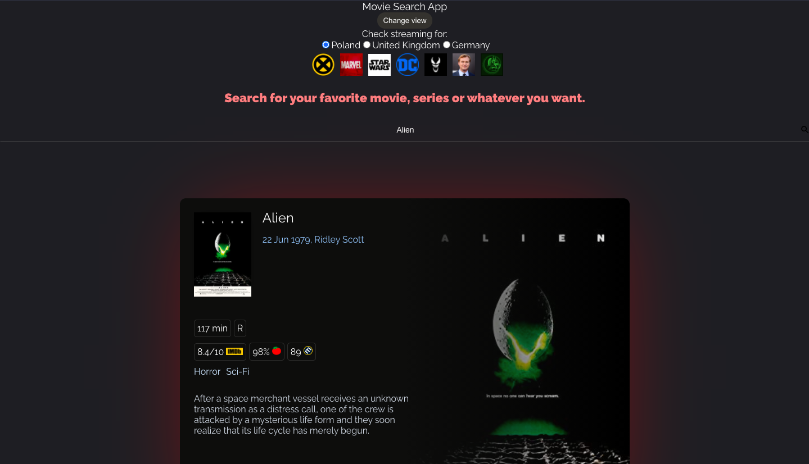
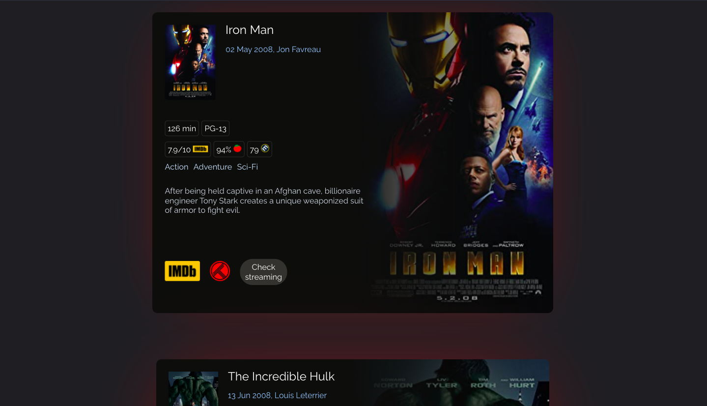
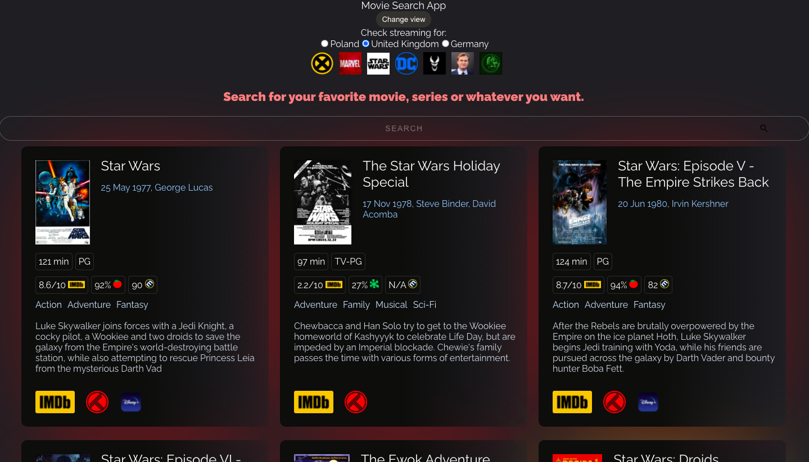
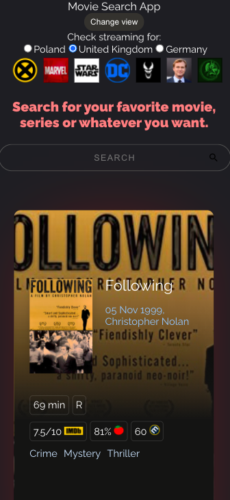
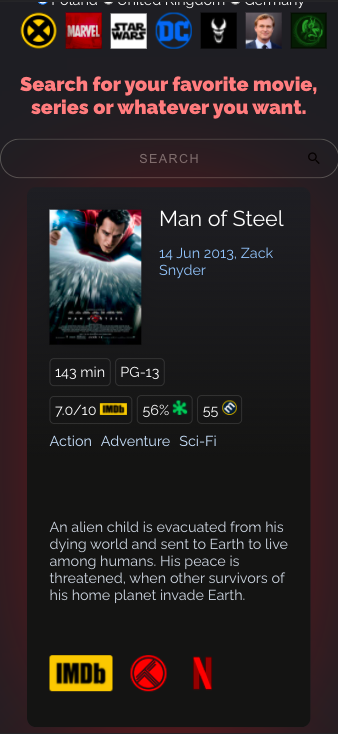

# Movie Search App
> Search for your favorite movie or tv show. Ckeck it on IMDb.com, trakt.tv or find out if it's on Netflix/Prime Videos or Disney Plus. (For now it checks availabiity for Netlix and Prime Vidoes in Poland and Disney Plus in UK)

## Table of contents
- [Movie Search App](#movie-search-app)
  - [Table of contents](#table-of-contents)
  - [Try it](#try-it)
  - [Screenshots](#screenshots)
      - [Landing Page](#landing-page)
      - [Search Option](#search-option)
      - [Two types of views](#two-types-of-views)
        - [Computer](#computer)
        - [Mobile](#mobile)
  - [Technologies](#technologies)
  - [Setup](#setup)
  - [Features](#features)
  - [Status](#status)
  - [Inspiration](#inspiration)
  - [Contact](#contact)

## [Try it](https://movie-search-app-react.herokuapp.com/)

## Screenshots

#### Landing Page


#### Search Option



#### Two types of views

##### Computer




##### Mobile



## Technologies
* JavaScript 
* React
* [OMDb API](http://www.omdbapi.com/)
* [Streaming Availability API](https://rapidapi.com/movie-of-the-night-movie-of-the-night-default/api/streaming-availability)

## Setup
```yarn start```

Runs the app in the development mode.\
Open [http://localhost:3000](http://localhost:3000) to view it in the browser.

The page will reload, if you make edits.
## Features
* Searching for movies, tv series and more
* Availability on Netflix, Prime Videos, Disney Plus and AppleTV.
* Links to imdB.com and trakt.tv
* Two view options - changes by clicking grid icon on the top of the page
* Fast option to show MCU, DCEU, Fox's X-men, Star Wars, Alien, Sony Venom Universe and Nolan movies.
* Movie info including [metacritic](https://www.metacritic.com/) , [imdB](https://www.imdB.com/), [rottentomatoes](https://www.rottentomatoes.com/) ratings.
* Works on computers and mobile devices as well
  


## Status
Project is: _in progress_

## Inspiration
I always wanted to have one app or page to find movies or tv series and find if they're available on my streaming services. I also wanted to create something in React, so I learned how does the React works and how to use API's in it. 

## Contact
Created by [@HondaPL](https://hacia.students.wmi.amu.edu.pl/)

This project was bootstrapped with [Create React App](https://github.com/facebook/create-react-app).

